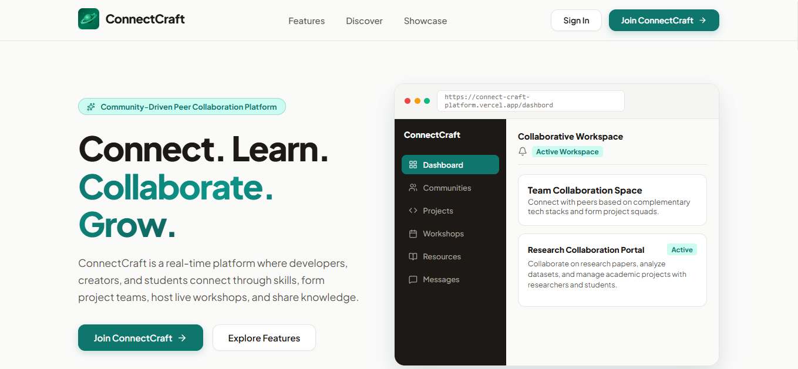
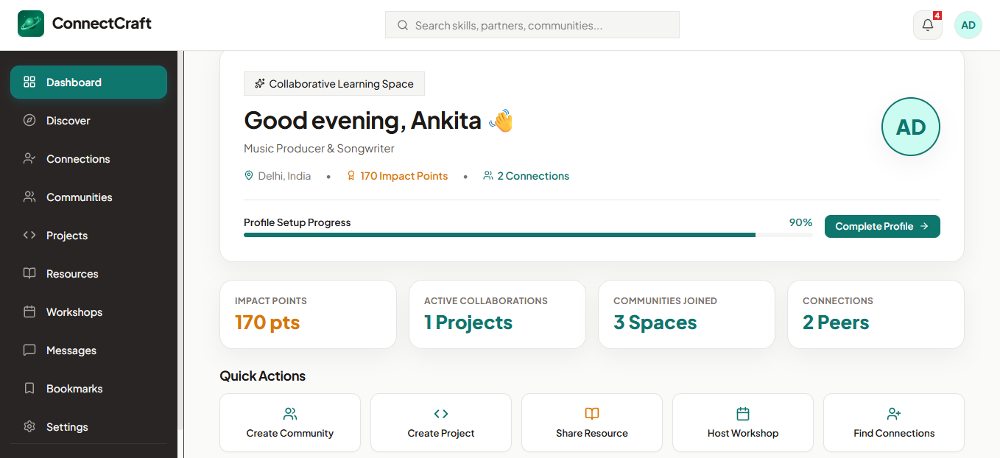
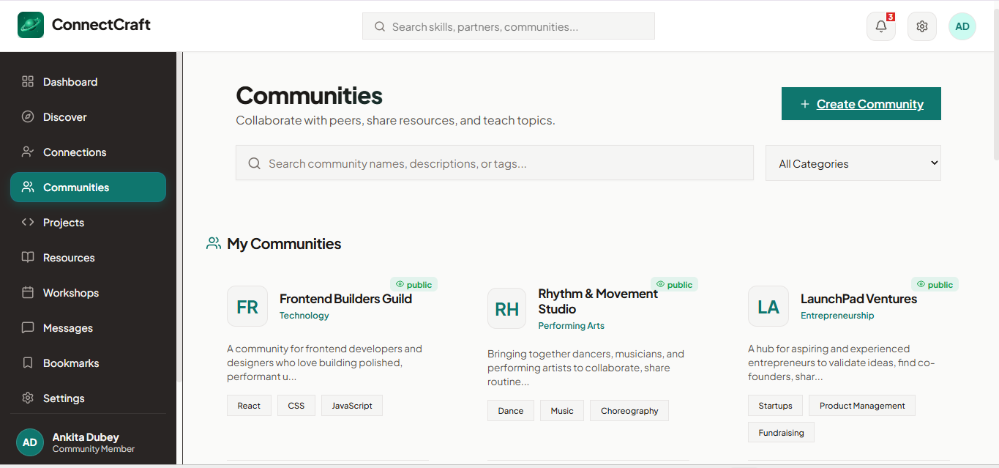
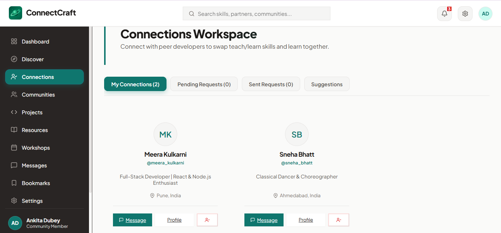
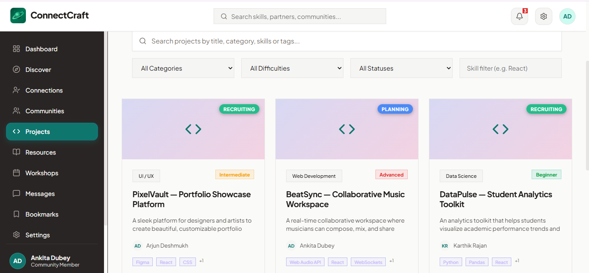
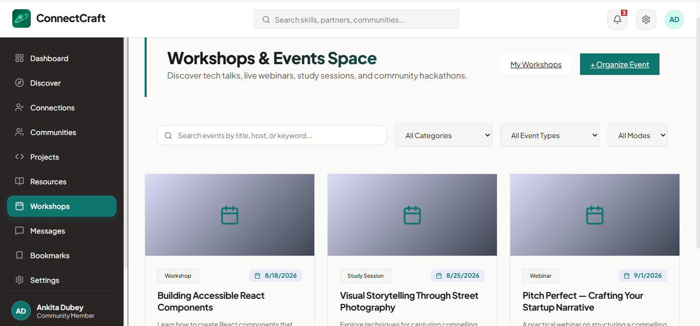
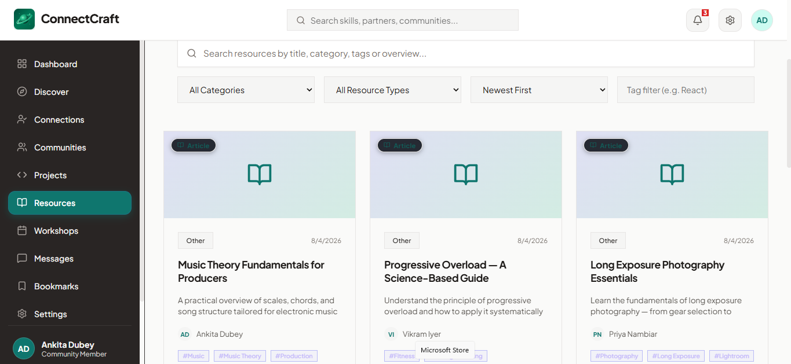
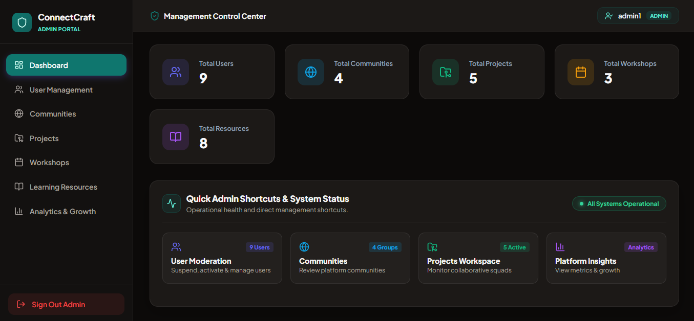

# ConnectCraft

ConnectCraft is a full-stack web application designed for peer collaboration, skill sharing, project building, and community discussions. It provides a platform where professionals, students, and creators can connect based on shared interests, organize project teams, publish learning resources, and participate in peer-led workshops.


## Features

### Authentication & User Profiles

* Account registration with email OTP verification staged through a temporary database collection.
* Password recovery flow using email OTP validation.
* JWT authentication delivered via HttpOnly cookies.
* Customizable user profiles with bio, headline, technical skill tags, and social links.
* Impact profile view displaying contribution points, activity badges, and reputation levels.
* Connection request system allowing users to connect with peers.

### Communities

* Topic-focused community spaces with member lists and category filtering.
* Discussion feeds allowing members to post questions and project calls.
* Community creation and management controls for community owners.

### Collaborative Projects

* Project creation with title, description, category, repository links, and required skill roles.
* Team member recruitment with custom position assignments.
* Task management milestones for tracking project progress.
* Project invitation system for recruiting connected peers.

### Learning Resources

* Resource sharing system supporting articles, documentation links, and video guides.
* Bookmarking functionality for saving resources to a personal collection.
* Upvoting system for highlighting useful content.

### Workshops

* Peer-led workshop creation with schedule dates, capacity limits, and access links.
* One-click attendee registration and registration tracking.
* Workshop management for hosts to update or cancel upcoming sessions.

### Real-Time Messaging

* Direct 1-on-1 messaging between connected users powered by Socket.IO.
* Unread message counters and real-time chat history loading.

### Admin Dashboard

* Role-based access control isolating admin management from standard user views.
* User account moderation with status toggling (active/suspended) and deletion controls.
* Content moderation tables for communities, projects, workshops, and resources.
* Category breakdown metrics and system uptime status indicators.

## Screenshots

| Landing Page | Dashboard Overview | Communities |
| :---: | :---: | :---: |
|  |  |  |

| Project Workspaces | Projects List | Workshops |
| :---: | :---: | :---: |
|  |  |  |

| Resources | Admin Dashboard |
| :---: | :---: |
|  |  

## Tech Stack

| Layer | Technologies |
| :--- | :--- |
| Frontend | React 19, Vite 8, React Router v6, Axios, Lucide Icons, Vanilla CSS |
| Backend | Node.js, Express.js |
| Database | MongoDB, Mongoose ODM |
| Real-Time Gateway | Socket.IO |
| Authentication | JWT, HttpOnly Cookies, Bcrypt.js |
| Email Service | Google Apps Script Web App API |
| Cloud Storage | Cloudinary (with local storage fallback) |

## Project Structure

```text
ConnectCraft/
├── client/
│   ├── src/
│   │   ├── components/      # Reusable UI elements, navigation, and protected routes
│   │   ├── context/         # Auth, Socket, and Toast context providers
│   │   ├── pages/           # Application route pages
│   │   ├── services/        # Axios API client setup
│   │   ├── styles/          # Modular CSS files
│   │   └── utils/           # Utility helpers
│   └── package.json
├── server/
│   ├── config/              # Cloudinary configuration
│   ├── controllers/         # API request handlers
│   ├── middleware/          # JWT auth and admin role verification
│   ├── models/              # Mongoose schemas
│   ├── routes/              # Express endpoint routes
│   ├── services/            # Database and business logic services
│   ├── socket/              # Socket.IO connection manager
│   ├── utils/               # Email service wrapper
│   └── server.js            # Server entry point and database connection
├── docs/
│   └── screenshots/         # Documentation screenshots
└── README.md
```

## Installation

### Prerequisites

* Node.js v18.0.0 or higher
* MongoDB running locally or a MongoDB Atlas cluster URL

### Backend Setup

Navigate to the server directory, install dependencies, and start the development server:

```bash
cd server
npm install
npm run dev
```

### Frontend Setup

Navigate to the client directory, install dependencies, and start the development server:

```bash
cd client
npm install
npm run dev
```

The frontend application runs at `http://localhost:5173` and proxies backend API calls to `http://localhost:5000`.

## Environment Variables

### Server Configuration (`server/.env`)

```env
PORT=
MONGO_URI=
JWT_SECRET=
ADMIN_SECRET_KEY=
GOOGLE_APPS_SCRIPT_URL=
CLOUDINARY_CLOUD_NAME=
CLOUDINARY_API_KEY=
CLOUDINARY_API_SECRET=
CLIENT_URL=
```

### Client Configuration (`client/.env`)

```env
VITE_API_BASE_URL=
```

## Deployment

Deploying ConnectCraft requires configuring external services and environment variables:

* **Database**: Set `MONGO_URI` to a MongoDB Atlas cluster connection string. The server includes DNS configuration for Atlas SRV resolution.
* **File Uploads**: Configure `CLOUDINARY_CLOUD_NAME`, `CLOUDINARY_API_KEY`, and `CLOUDINARY_API_SECRET` to handle user avatar uploads. If omitted, files are stored locally in `server/uploads/`.
* **OTP Email Delivery**: Set `GOOGLE_APPS_SCRIPT_URL` to a deployed Google Apps Script Web App endpoint that handles email dispatch.
* **Environment Configuration**: Set `NODE_ENV=production` and update `CLIENT_URL` to match the deployed client domain for CORS and cookie delivery.

## Security

* **JWT Authentication**: User sessions are authenticated using JSON Web Tokens signed by the server.
* **HttpOnly Cookies**: Authentication tokens are stored in `HttpOnly` cookies to mitigate XSS vulnerabilities.
* **Password Hashing**: User passwords are encrypted using `bcryptjs` with salt rounds prior to persistence.
* **OTP Verification**: Pending user registrations are stored temporarily with a 5-minute expiration window until email OTP verification succeeds.
* **Protected Routes**: Client-side route guards prevent unauthorized access to private views.
* **Admin Authorization**: Middleware verifies administrative role privileges before executing moderation or management actions.

## Future Enhancements


*## Future Enhancements

* AI-powered collaborator and community recommendations based on user skills, interests, and activity.
* Group messaging and dedicated collaboration channels for communities, workshops, and project teams.
* Advanced search and smart filtering across members, communities, projects, workshops, and learning resources.
* Team workspaces with shared task boards, milestones, file sharing, and collaborative project management.
* Calendar integration with automated reminders and real-time notifications for workshops, community events, and project deadlines.
